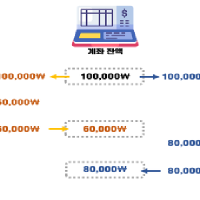
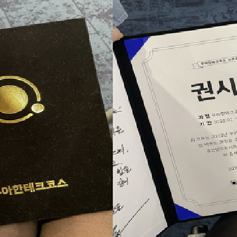
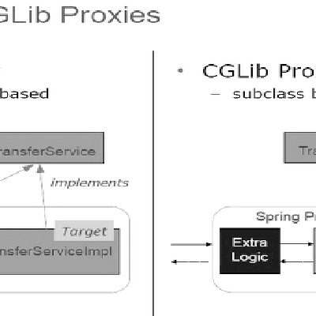
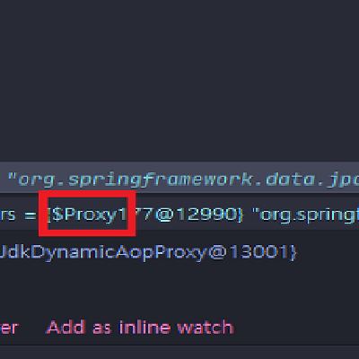
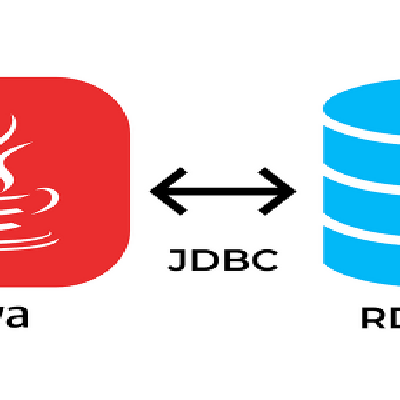

### 🚀 About Me

- 안녕하세요! 신입 백엔드 개발자 권시연 입니다.
- 블로그, 깃허브 등 꾸준한 기록 활동을 통해 **꾸준함을 증명**할 수 있습니다.
- **지식을 공유하며 소통**하는 활동을 좋아하여 [한이음](https://www.hanium.or.kr/portal/index.do), [글또](https://www.notion.so/ac5b18a482fb4df497d4e8257ad4d516), [MeetCoder](https://github.com/Meet-Coder-Study/posting-review) 등 20여 개 이상의 스터디 또는 멘토 멘티에 참여 하였습니다.
- **모르는 것을 빠르게 질문**하고, 자신의 의견을 드러내는 것에 불편함이 없습니다.
- 유지보수하기 좋은 코드가 누구든지 이해할 수 있는, 좋은 코드라고 생각합니다.

 

### 📚 Blog
<table><tbody><tr>
<td>
    <a href="https://yeonyeon.tistory.com/292">
         
        
2022 신입 개발자의 취준 일기

    </a>
    
0. 서론 😎 올해를 회고하자면 '우테코', '취업' 이 2가지가 전부이다. 우테코에 대...

    
22.12.14

</td>
<td>
    <a href="https://yeonyeon.tistory.com/291">
         
        
[Java] 동시성 이슈 해결하기 (1)

    </a>
    
같은 계좌를 이용하는 A와 B라는 이용자가 있다고 가정한다. 동일한 시간에 A는 카드를 이...

    
22.12.09

</td>
<td>
    <a href="https://yeonyeon.tistory.com/290">
         
        
[우테코] 우아한테크코스 4기 수료 후기

    </a>
    
11월 25일 금요일, 우아한테크코스 4기가 마무리되었다. 이 글을 취직 후 나름의 성공(...

    
22.11.27

</td>
</tr>
<tr>
<td>
    <a href="https://yeonyeon.tistory.com/289">
         
        
[Spring/AOP] JDK Dynamic Proxy vs CGLIB Proxy

    </a>
    
목차 JDK Dynamic Proxy vs CGLIB Proxy JDK Dynamic Pr...

    
22.11.23

</td>
<td>
    <a href="https://yeonyeon.tistory.com/288">
         
        
[JPA] @Query와 @Transactional을 꼭 같이 써야하나요?🤔

    </a>
    
😄 서론 지난 번에 deleteAll과 관련해 N+1 문제가 발생했었다. 그 과정에 @Q...

    
22.11.17

</td>
<td>
    <a href="https://yeonyeon.tistory.com/287">
         
        
[우테코] JDBC 라이브러리 구현 미션 학습 로그

    </a>
    
포스팅을 깜빡하고 있다가 여태까지 한 미션들을 복습하며 이제야 정리하게 되었다. 1. 요구...

    
22.11.13

</td>
</tr>
</tbody></table>